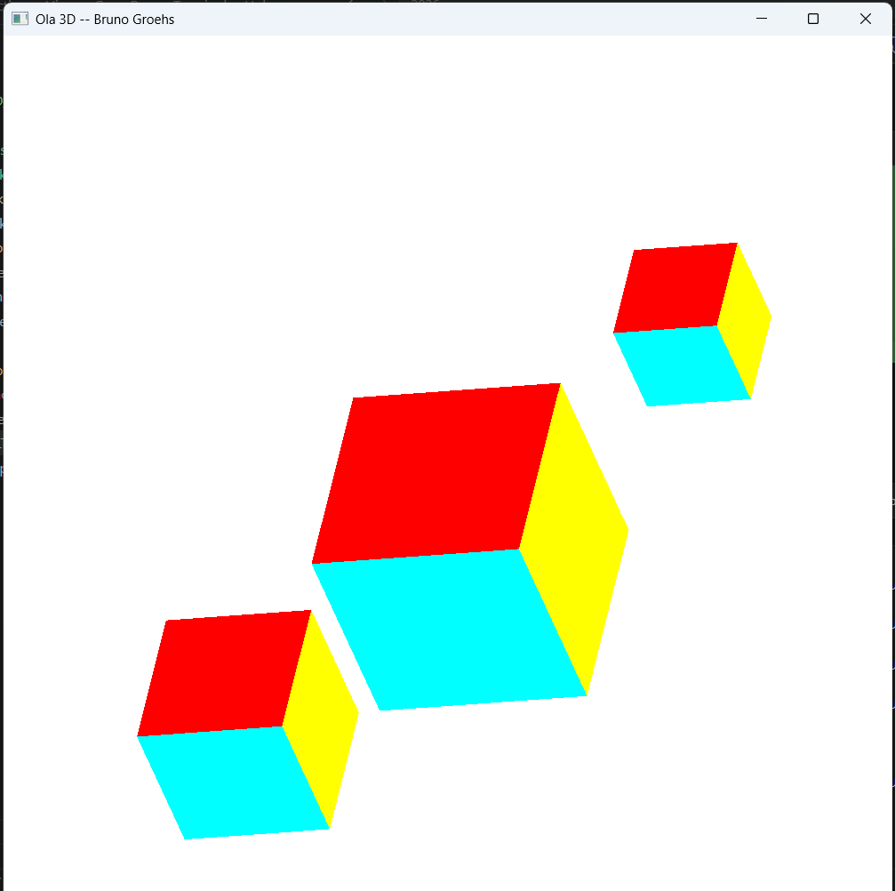
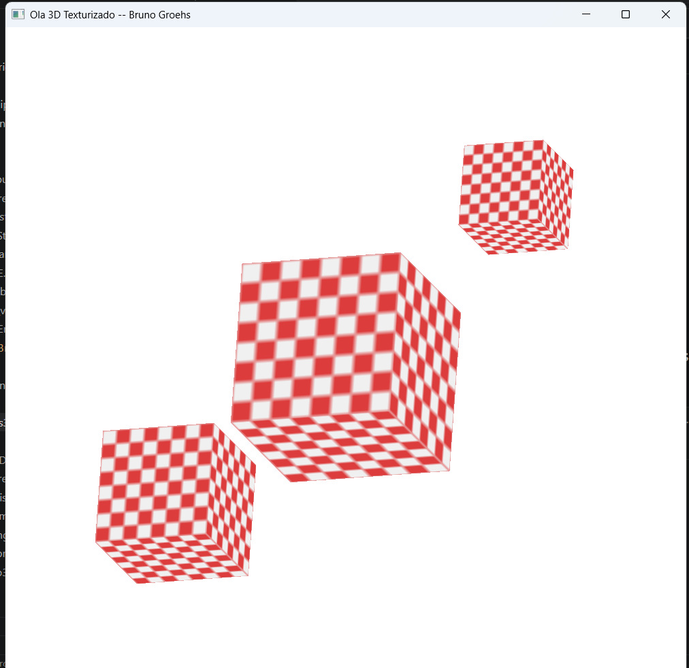
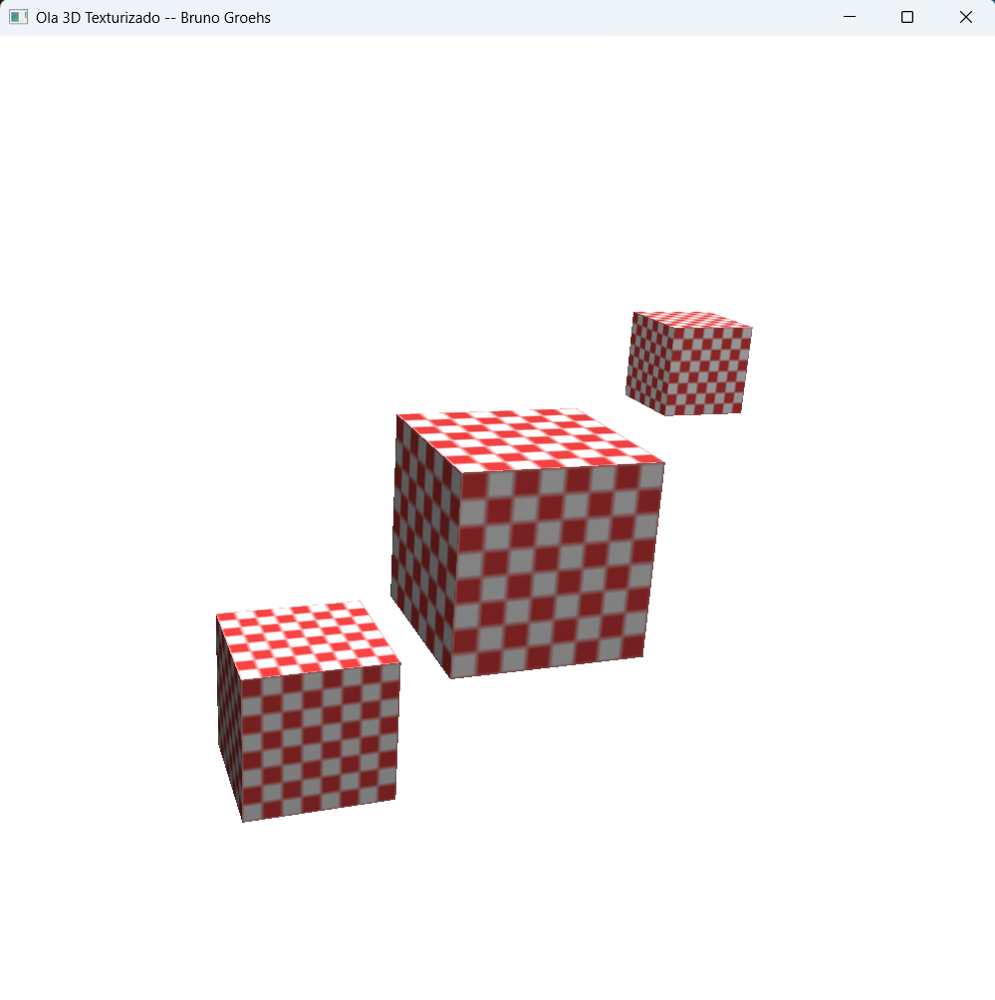

# Result

# Instanciando objetos na cena 3D

## Comandos de Teclado (Como Usar)

- **W, S**: Move (translada) os cubos no eixo Y (para cima e para baixo).
- **A, D**: Move (translada) os cubos no eixo X (para a esquerda e para a direita).
- **I, K**: Move (translada) os cubos no eixo Z (aproximar e afastar / zoom).
- **[ e ]** (Colchetes): Altera a escala uniforme dos cubos (diminuir e aumentar o tamanho). *(Nota: dependendo do teclado ABNT2, podem corresponder às teclas de acento e colchete).*
- **X, Y, Z**: Ativa/desativa a rotação contínua dos cubos nos respectivos eixos.
- **ESC**: Fecha a aplicação.

# Adicionando Texturas

# Adicionando Iluminação
